| | maximum absorption wavelength | maximum emission wavelength | absorption bandwidth | absorption molar extinction coefficient | emission bandwidth | quantum yield | log lifetime |
| --- | --- | --- | --- | --- | --- | --- | --- |
| **group by smiles** | |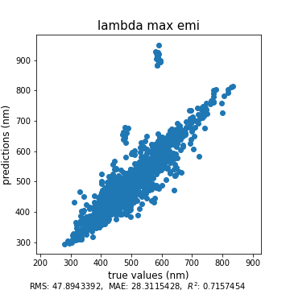 |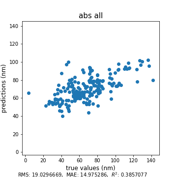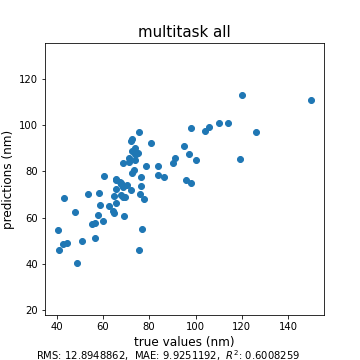 | |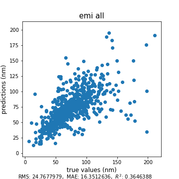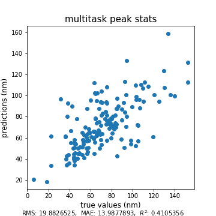 |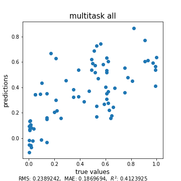 | |
| **random** |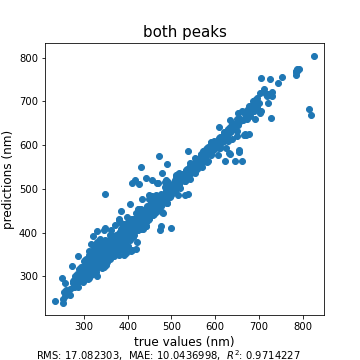 |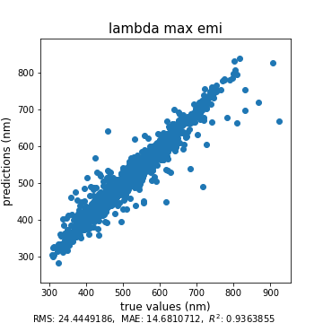 |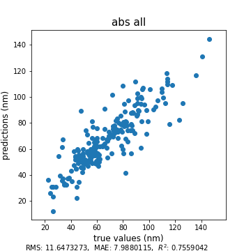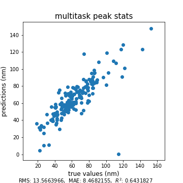 | |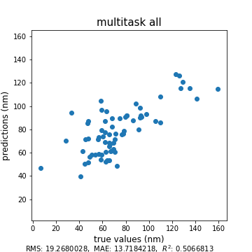 |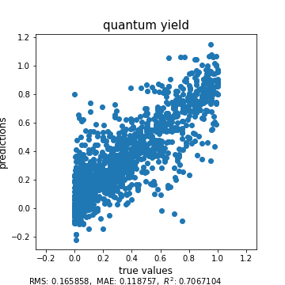 | |
| **scaffold** |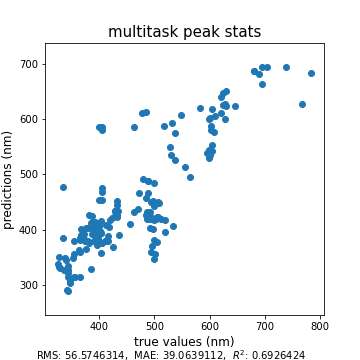 |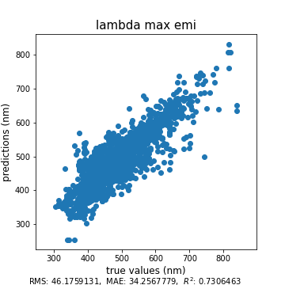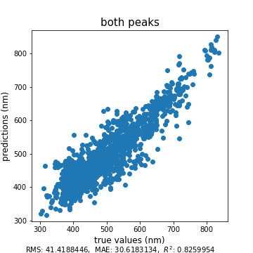 |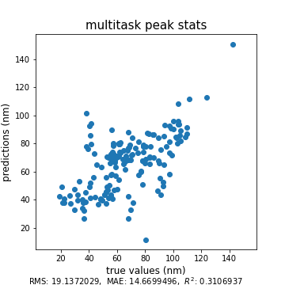 |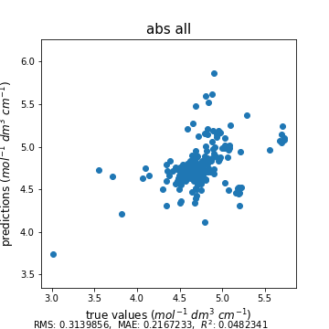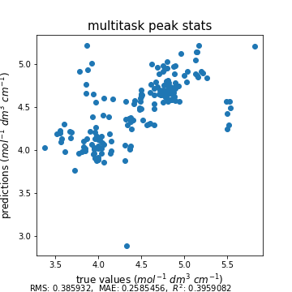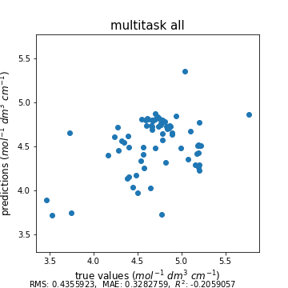 | |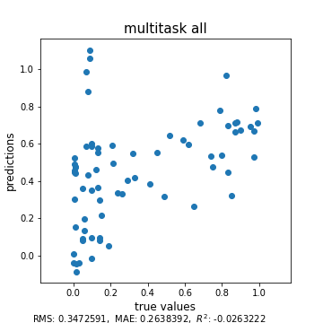 | |
